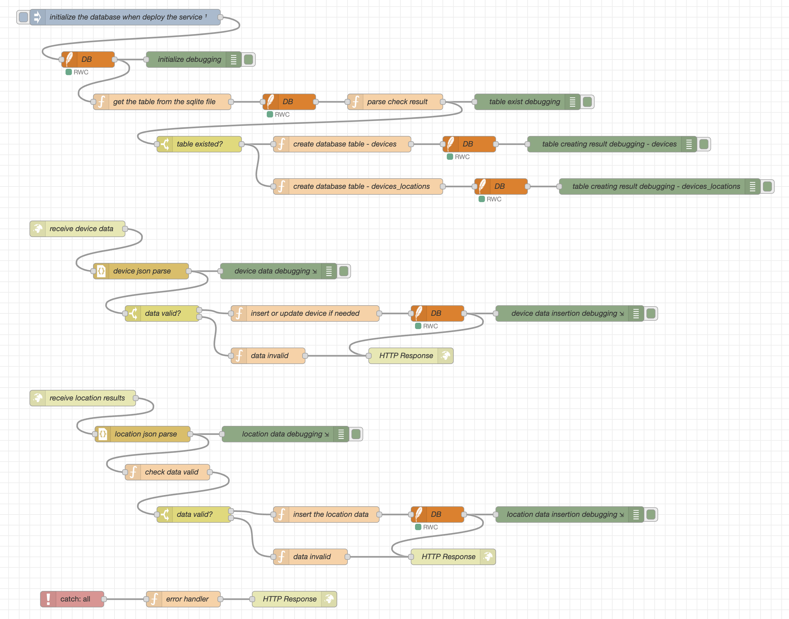

# 🛰️ CpE 415 - Location-Aware IoT Device Tracking System

This project was developed as part of the **CpE 415 (Embedded Systems / IoT)** course.  
It demonstrates a complete **IoT-based location tracking system** that allows devices to automatically register, send GPS data to a backend, and visualize their movement on a live map interface.

---

## 📖 Overview

**Goal:**  
To build a real-time device tracking system using ESP32 microcontrollers with GPS modules.  
Each device connects to a Wi-Fi network, registers itself on the server, and continuously uploads GPS coordinates.  
The server stores and visualizes all device locations using Flask, SQLite, and Leaflet.js.

**Main Features:**

- Real-time location updates displayed on an interactive web map.
- Automatic device registration upon startup.
- Smooth simulated motion for testing without GPS signal.
- Backend REST API built with Flask.
- Persistent data storage in SQLite.
- Responsive web interface using Leaflet and OpenStreetMap.
- Frontend updates device positions every second without reloading the page.


---

## 🧱 System Architecture

```
+---------------------+       +-----------------------+       +-------------------------------+
|  ESP32 with GPS     |  -->  |  Flask REST Backend   |  -->  |  Web Dashboard (Leaflet)      |
|  (Wi-Fi + HTTP POST)|       |  (Python + SQLite DB) |       |  (HTML + JS + OpenStreetMap)  |
+---------------------+       +-----------------------+       +-------------------------------+
```

Data flows from the ESP32 devices sending GPS data via HTTP POST requests to the Flask backend, which stores the information in the SQLite database and serves it to the web dashboard for real-time visualization.

---

## ⚙️ Technologies Used

| Component     | Technology                              |
|---------------|---------------------------------------|
| **Hardware**  | ESP32/Arduino Uno R4(WIFI) microcontroller with GPS module |
| **Backend**   | Python 3 + Flask                      |
| **Database**  | SQLite (stored in `/tmp/sqlite`)      |
| **Frontend**  | HTML, JavaScript, Leaflet.js          |
| **Communication** | HTTP REST (JSON format)             |

---

## 🗃️ Database Schema

```sql
CREATE TABLE IF NOT EXISTS "devices" (
  id text PRIMARY KEY,
  name text,
  description text,
  created_at datetime DEFAULT(CURRENT_TIMESTAMP)
);

CREATE TABLE IF NOT EXISTS "device_locations" (
  id integer PRIMARY KEY AUTOINCREMENT,
  device_id text NOT NULL,
  latitude real NOT NULL,
  longitude real NOT NULL,
  "timestamp" datetime DEFAULT(CURRENT_TIMESTAMP),
  FOREIGN KEY (device_id) REFERENCES "devices" (id)
);
```

---------

## 🧠 Node-Red Workflows



---

## 🧠 How It Works

1. **ESP32 Device Startup:** Upon powering on, each ESP32 device connects to a configured Wi-Fi network. It then attempts to register itself with the Flask backend by sending a unique device ID and metadata.

2. **GPS Data Acquisition:** The ESP32 reads GPS coordinates from its attached GPS module. If GPS data is unavailable, the device simulates smooth movement for testing purposes.

3. **Data Transmission:** The device continuously sends its current location data to the backend via HTTP POST requests in JSON format.

4. **Backend Processing:** The Flask server receives incoming data, verifies device registration, and stores the location updates in the SQLite database.

5. **Frontend Visualization:** The web dashboard fetches the latest device locations from the backend every second and updates the interactive Leaflet map accordingly, showing real-time device positions and movement trails.

---

## 💻 ESP32 Firmware Overview

- **Device Registration:** On startup, the firmware generates or reads a unique device ID and registers it with the backend server via HTTP POST.

- **GPS Reading:** The firmware reads latitude and longitude data from the connected GPS module using serial communication.

- **Simulated Movement:** If GPS data is not available (e.g., indoors or during testing), the firmware simulates smooth motion by incrementally adjusting coordinates.

- **HTTP POST Requests:** The firmware sends JSON-formatted location data, including device ID, latitude, longitude, and timestamp, to the Flask REST API endpoint at regular intervals (e.g., every second).

- **Debug Output:** Serial prints provide status updates, including Wi-Fi connection status, GPS readings, and HTTP request results.

---

## 🌐 Web Dashboard

- **Map Interface:** Built with Leaflet.js and OpenStreetMap tiles, the dashboard displays all registered devices as markers on the map.

- **Real-Time Updates:** Using JavaScript's `setInterval`, the dashboard polls the backend API every second to retrieve the latest device locations.

- **Marker Management:** Device markers are dynamically added, moved, or removed based on the latest data, providing smooth real-time tracking.

- **User Interaction:** Users can click on device markers to view details such as device name, last update time, and coordinates.

- **Responsive Design:** The dashboard is designed to be accessible on various devices, including desktops, tablets, and smartphones.

---

## 🚀 Setup and Deployment

1. **Install Python Dependencies:**
   ```bash
   pip install flask flask-cors
   ```

2. **Run the Flask Backend:**
   ```bash
   export FLASK_APP=app.py
   flask run --host=0.0.0.0 --port=60000
   ```
   This starts the REST API server accessible on your local network.

3. **Configure ESP32 Firmware:**
   - Set your Wi-Fi SSID and password in the Arduino code.
   - Set the backend server IP and port.
   - Compile and upload the firmware to your ESP32 device.

4. **Connect ESP32 Devices:**
   - Power on the ESP32 devices.
   - They will connect to Wi-Fi, register with the backend, and start sending GPS data.

5. **Access the Web Dashboard:**
   - Open a web browser.
   - Navigate to `http://127.0.0.1:60000` to view the live map and device locations.

---

## 📡 Example Serial Output

```
[INFO] Connecting to Wi-Fi SSID: MyNetwork
[INFO] Wi-Fi connected. IP address: 192.168.1.45
[INFO] Registering device ID: esp32-device-001
[INFO] Device registration successful.
[INFO] Reading GPS data...
[INFO] GPS fix acquired: Latitude=37.7749, Longitude=-122.4194
[INFO] Sending location update to server...
[INFO] Server response: 200 OK
[INFO] Waiting 1000ms before next update...
```

---

## 📚 Future Improvements

- Integrate **MQTT** protocol for more efficient and scalable device communication.
- Add **user authentication and device access control** to secure the backend and dashboard.
- Implement **3D map views** using libraries like CesiumJS for enhanced visualization.
- Incorporate **historical playback** of device movements over time.
- Enable **push notifications** for geofence alerts or device status changes.
- Add support for **multiple GPS modules and sensor fusion** to improve location accuracy.